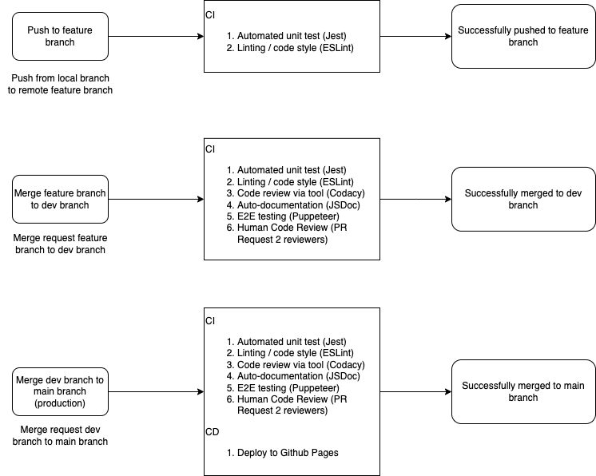

## Current Pipeline

A diagram of our current pipeline can be seen below: 

### Linting via Automation and Local Development:

Our current pipeline consists of a linting procedure which is done by eslint named `CI - Linter` on Github Actions. The procedure is activated by github actions on all branches whenever the actions `push` and `pull request` are made to the `dev` and `main` branches. More specifically, we specified eslint with the linter configurations from **both** google and eslint:recommended. A complete set of linting/style checks can be found [here](https://github.com/google/eslint-config-google/blob/master/index.js).

There is also a pipeline folder located at the root of the repository which locates the config file of the linting procedure, which overrides several rules. Some of which are jsdocs to warning and unused variable as warnings instead of errors. This is because we forsee that we will have the functions and the jsdocs written out before the body of the javascript file is written out. Jsdocs are also set as warnings because we don't want people be stuck on writing out documentation for every function they use (when they push), in the case that their version of the code isn't used. Linting rules can also be revised further during development. 
 
For developers, they should run `npx eslint --config ./pipeline/.eslintrc.yml ./source/js` to see warning and errors if they want to see their styling errors. Adding `--fix` tag while running eslint locally will fix most errors.  An example of it working is shown below, where we can see that `foo` has various errors, and `hello` fixes all of said errors/warnings:  
 
By default, the github action for linting is only looking to take javascript files in ./source/js.

### Code Quality via Tool:

Our pipeline currently checks code quality via the tool Codacy through the `Codacy Analysis CLI` workflow. This workflow is triggered when pushes are made to the `main` and  `dev` branches, and when pull requests are made to `main` and `dev`. Upon activation of the workflow, Codacy checks out the specific branch or commit that triggered the workflow and performs a static code analysis of the specific files involved. Depending on the Codacy configuration, Codacy will identify issues in several areas like code style violations, security vulnerabilities, overly complex code, and duplicated code.

Currently, Codacy is configured to run with default rules, and assumes that we are using ES6 syntax when it provides its analysis. The rules and what we want Codacy to evaluate as part of its analysis can be configured later to be more specific to our application, once we have started development on the application itself.

### Code Quality via Human Review:

At present we have implemented a ruleset in GitHub that restricts the push and pull requests to main and dev branches. These branches are protected from deletion and require all commits be made to a non-target branch and submitted via a pull request before they can be merged. We also require two reviewers to approve the request before a pull request can be merged.

### Documentation Generation via Automation:

The pipeline currently includes automatic document generation. The "Generate JSDoc Documentation" GitHub Action automates the creation of HTML documentation from JavaScript code annotations using the JSDoc tool. This workflow is triggered by events such as pushes to specified branches (`main` and `dev`) or pull requests to `main` and `dev`, and streamlines documentation processes. Currently, upon activation of the worflow, the action installs Node.js and JSDoc, then generates documentation from the JavaScript files located in the test folder. The generated documentation is then placed in an "out" folder and is presently uploaded as an artifact within the GitHub workflow. This test folder will be updated to the actual script folder once we begin development on our application. Currently, the test folder was used to ensure the tool works correctly.

### Unit Testing via Automation:

We integrate unit testing into our pipeline through the “Unit Tests” GitHub Action which automates unit tests with Jest as the test framework. It is triggered by pushes to the `main`, `dev`, and feature branches, as well as pull requests to `main` and `dev`. Upon activation, this action checks out the branch, installs Jest, and runs a script to run every Jest unit test found in the repository, namely those found in the test/ folder. Once the tests have been completed, the results are displayed in the action page, indicating pass or failure. Currently, Jest interprets code as Common JS instead of ES6, which is currently not consistent with our other CI/CD workflows which assume ES6 formatting. As a result, further discussion must be made to determine which format the project must follow in order to avoid incorrect formatting issues.

### End to End Testing via Automation:

The CI/CD pipeline for E2E testing is implemented using GitHub Actions to automate the validation of application functionality. It is triggered by pushes or pull requests to specific branches (`main` and `dev`). The pipeline begins by checking out the repository and setting up a Node.js environment. It then installs project dependencies(Puppeteer).The E2E tests are executed using a designated script (`node test/source.js`). Additionally, a failure annotation is added to notify developers about issues, ensuring swift debugging. This workflow ensures consistent testing, integration with the development process, and clear visibility of test results.

### GithubPages Deployment via Automation:

Our application is a static web app built with HTML, CSS, and JavaScript. Since it doesn’t require a JavaScript framework like React or VueJS, we needed a simple, reliable, and free platform to host and deploy the app. GitHub Pages allows TAs and our team to easily access, test, and interact with the application. The workflow, defined in `.github/workflows/githubpage.yml`, automates the deployment process. It is triggered on pushes to the `main` or `dev` branches or pull requests targeting `main`. 

The pipeline consists of two main steps: First, the repository is checked out using `actions/checkout@v4`, and files are packaged as an artifact using `actions/upload-pages-artifact@v3`, with the artifact stored in the current working directory. Then, in the deploy step, the artifact is pulled and deployed to GitHub Pages using `actions/deploy-pages@v4`. Once deployed, the app is accessible via the configured GitHub Pages URL [linked here](https://cse210-team-09.github.io/cse210-fa24-group09/).

## Fixes

Currently only ESlint is present inside the package dependencies and rest of the packages (eg: Jest, JSDoc and Puppeteer) are installed globally in the runner. However, we want to have the other packages also added into the package dependencies. A Github Issue has been created to fix this problem and it will be resolved in the upcoming sprint. Essentially, our Github actions and pipeline work but we didn’t specify locally how to run most packages. 

Another fix that we would want to make in the next sprint is to configure Codacy based on set rules that we agree upon so that the report it returns is more relevant, as currently Codacy utilizes a default set of rules. We also want to use a Codacy config file to make the workflow ignore non-code files in our repository, like our meeting notes, images, etc., as we want it to only analyze the quality of the code files relevant to our application.  

Originally, we had a file with a single sum function as well as a test file for it to verify that Jest works as expected. This test file was written in Common JS format, instead of ES6 import/export format, because Jest assumes the Common JS format by default. The unit test in the file passes successfully, but pushing it to the dev branch caused issues with Codacy due to the format, as Codacy expected the ES6 import/export format, and thus raised an error when given the Common JS require format. To fix this, we removed the sum file and its corresponding test file, leaving only the `test.js` file currently in the test/ folder, which contains a single unit test that always passes inside of it. Since there is no need of importing modules due to the test being in the same file, Codacy passes as expected.

To prevent this issue from occuring again, we will discuss and decide whether we want to follow Common JS or ES6 for our application, and configure all of our tools so that it follows the same syntax rules in the next sprint.

## Future Pipeline

A diagram for how we want to expand on our pipeline and what it would look like with this expansion can be seen below: 

### Linting:

For linting, we are currently only linting for Javascript files in the `source/js` directory. In the future, we want to also look for formatting inconsistencies in CSS and HTML files as well. This likely can be done with ESlint by using the prettier plugin, having a `prettierc.yml` file in the root of the directory, and having all developers use the Prettier VSCode extension. Alternatively, we can also use a prettier ESLint plugin to integrate this change.

### Code Quality via Tool:

Currently, Codacy assumes that we are using ES6 syntax rules, when some of our code is written in CommonJS due to Jest. Thus, in the future we want to decide if we are going to use ES6 or CommonJS when writing our application, and configure our tools to follow the same syntax rules.

### Documentation:

For the code documentation using JSDoc tool, currently the documentation website generated is uploaded as an artifact within the GitHub workflow. Future enhancements will shift from artifact uploading to integrating a documentation link directly on a dedicated GitHub Page, which will also be deployed upon pull requests to the `dev` and `main` branches.

### E2E:

In our current pipeline, E2E testing using Puppeteer is done using a simple test file to check if the tool is working. In the future, we will implement the E2E testing on the application web pages after writing working code during development to ensure that our application is working as expected. The workflow is currently triggered only for pull and push requests to the `main` and `dev` branches, but in the future we also want to enable it to run for pushes to feature branches.

### Github Pages:

Currently, deployment using Github Pages is triggered only for pull requests to the `main` branch, but we plan to enable deployment for pull requests to the `dev` branch as well. The reason for this is to allow the team to test and validate changes in a staging environment before merging into `main`. Doing so means that any potential issues are caught early, and it improves the overall stability of the main branch.
