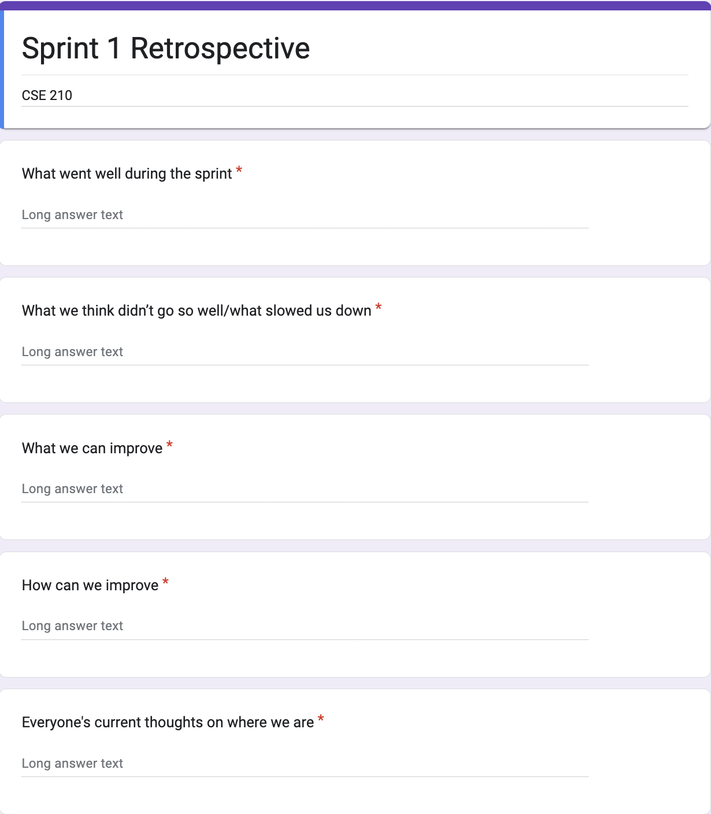
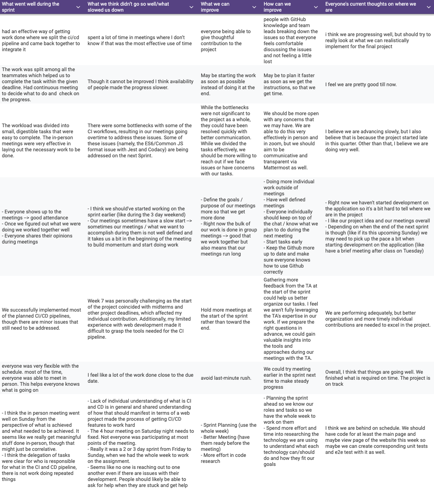

# Team Meeting Notes - Retrospective 1 Review Meeting

**Date: Monday 11.18.2024**\
**Time: 6:30 pm - 8:00 pm**\
**Meeting Format: Online (Zoom)**

## Attendance

- [x] Niyas Attasseri (NA)
- [x] Anna Niu (AN)
- [x] Krishna Ponnaganti (KP)
- [x] Juhak Lee (JL)
- [x] Brandon Olmos (BO)
- [x] Jayanth Gorantla (JG)
- [x] Lucas Lee (LL)

## Retrospective

The goal of this meeting is to reflect on how Sprint #1 went. We discussed our thoughts on what went well during the sprint, what didn't go well, what/how we can improve, and what everyone's thoughts are on where we currently are with the project. We collected everyone's thoughts using an anonymous Google Form. The questions in the form can be seen here: 

The individual responses collected can also be seen below: 

After collecting and reviewing these Google Form responses, we then had an open discussion regarding our thoughts on how the sprint went and what we hope to improve/change for the next sprint.

## What went well during the sprint

In this question, we discussed our thoughts on what went well overall during the sprint. Overall, we thought that the work for the CICD pipeline was divided effectively, meetings went well, and overall we were able to implement what we had planned for the pipeline. 

### Individual Responses:

1. Had an effective way of getting work done where we split the ci/cd pipeline and came back together to integrate it
2. The work was split among all the teammates which helped us to complete the task within the given deadline. Had continuous meeting to decide what to do and  check on the progress.
3. The workload was divided into small, digestible tasks that were easy to complete. The in-person meetings were very effective in laying out the necessary work to be done.
4.  - Everyone shows up to the meetings --> good attendance
    - Once we figured out what we were doing we worked together well
    - Everyone shares their opinions during meetings"
5. We successfully implemented most of the planned CI/CD pipelines, though there are minor issues that still need to be addressed.
6. Everyone was very flexible with the schedule. most of the time, everyone was able to meet in person. This helps everyone knows what is going on
7.  - I think the in person meeting went well on Sunday from the perspective of what is achieved and what needed to be achieved. It seems like we really get meaningful stuff done in-person, though that might just be correlative. 
    - I think the delegation of tasks were clear for who is responsible for what in the CI and CD pipeline, there is not work doing repeated things

## What we think didn’t go so well/what slowed us down

In this question, we discussed our thoughts on what didn't go well during the sprint, and what slowed down our progress. Overall, many people shared their thoughts regarding the length and effectiveness of meetings, and how we did majority of the work for the sprint towards the end of the sprint, rather than spreading the work out throughout the week.

### Individual Responses:

1. Spent a lot of time in meetings where I don’t know if that was the most effective use of time
2. Though it cannot be improved I think availability of people made the progress slower.
3. There were some bottlenecks with some of the CI workflows, resulting in our meetings going overtime to address these issues. Some of these issues (namely, the ES6/Common JS format issue with Jest and Codacy) are being addressed on the next Sprint.
4.  - I think we should've started working on the sprint earlier (like during the 3 day weekend)
    - Our meetings sometimes have a slow start --> sometimes our meetings / what we want to accomplish during them is not well defined and it takes us a bit in the beginning of the meeting to build momentum and start doing work"
5. Week 7 was personally challenging as the start of the project coincided with midterms and other project deadlines, which affected my individual contribution. Additionally, my limited experience with web development made it difficult to grasp the tools needed for the CI pipeline.
6. I feel like a lot of the work done close to the due date. 
7.  - Lack of individual understanding of what is CI and CD is in general and shared understanding of how that should manifest in terms of a web project made the process of getting CI/CD features to work hard
    - The 4 hour meeting on Saturday night needs to fixed. Not everyone was participating at most points of the meeting. 
    - Really it was a 2 or 3 day sprint from Friday to Sunday, when we had the whole week to work on the assignment. 
    - Seems like no one is reaching out to one another even if there are issues with their development. People should likely be able to ask for help when they are stuck and get help

## What we can improve

We asked everyone their thoughts on what can be improved for future sprints. People mainly shared their thoughts on planning the meetings better so we know what we want to accomplish during each meeting, holding more effective meetings, and starting work on the sprint earlier.

### Individual Responses:

1. Everyone being able to give thoughtful contribution to the project 
2. May be starting the work as soon as possible instead of doing it at the end.
3. While the bottlenecks were not significant to the project as a whole, they could have been resolved quickly with better communication. While we divided the tasks effectively, we should be more willing to reach out if we face issues or have concerns with our tasks. 
4.  - Define the goals / purpose of our meetings more so that we get more done
    - Right now the bulk of our work is done in group meetings --> good that we work together but also means that our meetings run long"
5. Hold more meetings at the start of the sprint rather than toward the end.
6. Avoid last-minute rush.
7.  - Sprint Planning (use the whole week)
    - Better Meeting (have them ready before the meeting)
    - More effort in code research

## How can we improve

Based on their concerns discussed above, people also shared their thoughts on how we can improve for future sprints. These improvements include getting more feedback from the TA, starting work earlier, meeting earlier in the sprint to avoid doing work last minute, and being open to asking feedback from group members if you are stuck on something rather than waiting to bring it up at the group meetings.

### Individual Responses:

1. People with GitHub knowledge and team leads breaking down the issues so that everyone feels comfortable discussing the issues and not feeling a little lost
2. May be to plan it faster as soon as we get the instructions, so that we get time.
3. We should be more open with any concerns that we may have. We are able to do this very effectively in person and in zoom, but we should aim to be communicative and transparent via Mattermost as well.
4.  - Doing more individual work outside of meetings
    - Have well defined meetings
    - Everyone individually should keep on top of the chat / know what we plan to do during the next meeting
    - Start tasks early
    - Keep the Github more up to date and make sure everyone knows how to use Github correctly"
5. Gathering more feedback from the TA at the start of the sprint could help us better organize our tasks. I feel we aren't fully leveraging the TA's expertise in our work. If we prepare the right questions in advance, we could gain valuable insights into the tools and approaches during our meetings with the TA.
6. We could try meeting earlier in the sprint next time to make steady progress
7.  - Planning the sprint ahead so we know our roles and tasks so we have the whole week to work on them 
    - Spend more effort and time into researching the technology we are using to understand what each technology can/should do and how they fit our goals

## Everyone's current thoughts on where we are

Finally, everyone shared their thoughts on where we currently are in the process. Overall, people expressed that we were progressing well, but some expressed concerns about not having started development on the application itself, considering that by the end of this coming week we want to have a demo working that we can show on video.

### Individual Responses:

1. I think we are progressing well, but should try to really look at what we can realistically implement for the final project 
2. I feel we are pretty good till now.
3. I believe we are advancing slowly, but I also believe that is because the project started late in this quarter. Other than that, I believe we are doing very well.
4.  - Right now we haven't started development on the application so it's a bit hard to tell where we are in the project
    - I like our project idea and our meetings overall
    - Depending on when the end of the next sprint is though (like if its this upcoming Sunday) we may need to pick up the pace a bit when starting development on the application (like have a brief meeting after class on Tuesday)"
5. We are performing adequately, but better organization and more timely individual contributions are needed to excel in the project.
6. Overall, I think that things are going well. We finished what is required on time. The project is on track
7. I think we are behind on schedule. We should have code for at least the main page and maybe view page of the website this week so maybe we can create corresponding unit tests and e2e test with it as well.
