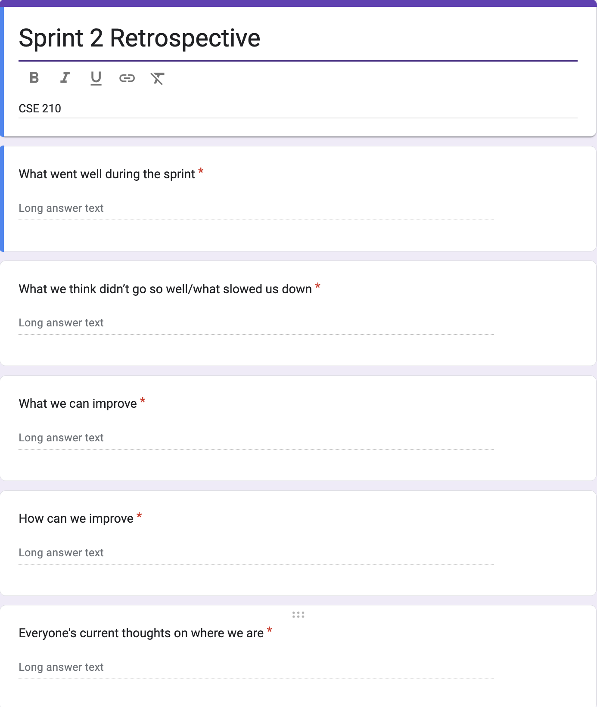
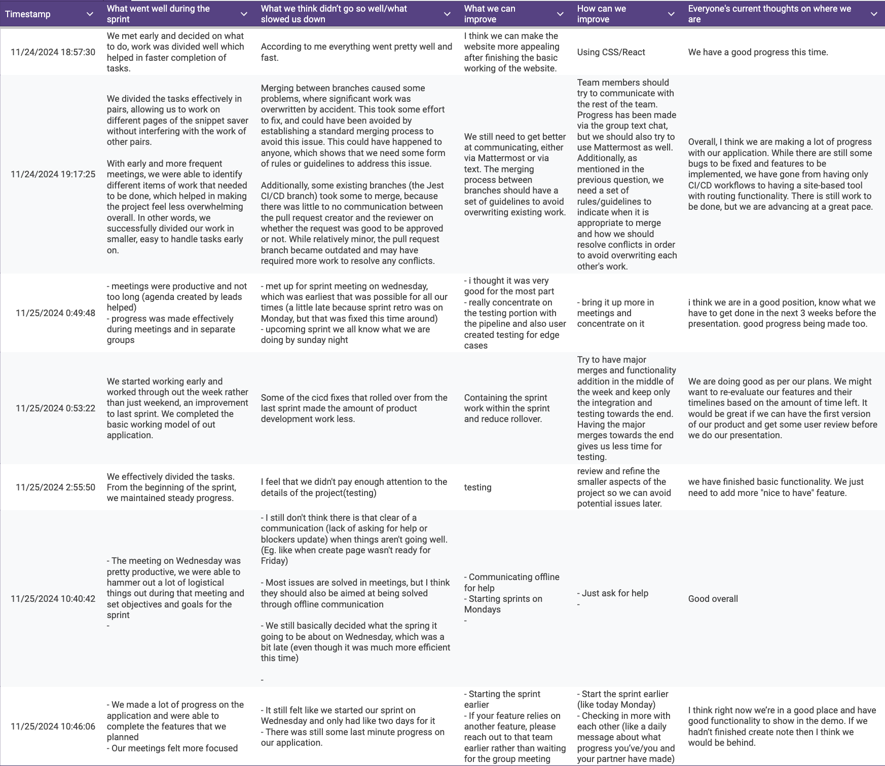

# Team Meeting Notes - Retrospective 2 Review Meeting

**Date: Monday 11.18.2024**\
**Time: 11:00 am - 11:30 am**\
**Meeting Format: In-Person (CSE Basement)**

## Attendance

- [x] Niyas Attasseri (NA)
- [x] Anna Niu (AN)
- [x] Krishna Ponnaganti (KP)
- [x] Juhak Lee (JL)
- [x] Brandon Olmos (BO)
- [x] Jayanth Gorantla (JG)
- [x] Lucas Lee (LL)

## Retrospective

The goal of this meeting is to reflect on how Sprint #2 went. We discussed our thoughts on what went well during the sprint, what didn't go well, what/how we can improve, and what everyone's thoughts are on where we currently are with the project. We collected everyone's thoughts using an anonymous Google Form. The questions in the form can be seen here: 

The individual responses collected can also be seen below: 

After collecting and reviewing these Google Form responses, we then had an open discussion regarding our thoughts on how the sprint went and what we hope to improve/change for the next sprint.

## What went well during the sprint

In this question, we discussed our thoughts on what went well overall during the sprint. Overall, we thought that the work for this sprint was divided effectively as we worked in pairs for the various features, meetings were more productive and focused, and we made good progress on our features and completed the tasks we set out for ourselves.

### Individual Responses:

1. We met early and decided on what to do, work was divided well which helped in faster completion of tasks.
2. We divided the tasks effectively in pairs, allowing us to work on different pages of the snippet saver without interfering with the work of other pairs.
   With early and more frequent meetings, we were able to identify different items of work that needed to be done, which helped in making the project feel less overwhelming overall. In other words, we successfully divided our work in smaller, easy to handle tasks early on.
3. - meetings were productive and not too long (agenda created by leads helped)
   - progress was made effectively during meetings and in separate groups
4. We started working early and worked through out the week rather than just weekend, an improvement to last sprint. We completed the basic working model of out application.
5. We effectively divided the tasks. From the beginning of the sprint, we maintained steady progress.
6. - The meeting on Wednesday was pretty productive, we were able to hammer out a lot of logistical things out during that meeting and set objectives and goals for the sprint
7. - We made a lot of progress on the application and were able to complete the features that we planned
   - Our meetings felt more focused

## What we think didn’t go so well/what slowed us down

In this question, we discussed our thoughts on what didn't go well during the sprint, and what slowed down our progress. Overall, there was some concern about the start of the sprint still being on Wednesday, handling merge conflicts between branches, having more offline communication rather than the bulk of communicating between pairs being during meetings, and lack of testing the application after implementing the features.

### Individual Responses:

1. According to me everything went pretty well and fast.
2. Merging between branches caused some problems, where significant work was overwritten by accident. This took some effort to fix, and could have been avoided by establishing a standard merging process to avoid this issue. This could have happened to anyone, which shows that we need some form of rules or guidelines to address this issue.
   Additionally, some existing branches (the Jest CI/CD branch) took some to merge, because there was little to no communication between the pull request creator and the reviewer on whether the request was good to be approved or not. While relatively minor, the pull request branch became outdated and may have required more work to resolve any conflicts.
3. - met up for sprint meeting on wednesday, which was earliest that was possible for all our times (a little late because sprint retro was on Monday, but that was fixed this time around)
   - upcoming sprint we all know what we are doing by sunday night
4. Some of the cicd fixes that rolled over from the last sprint made the amount of product development work less.
5. I feel that we didn't pay enough attention to the details of the project(testing)
6. - I still don't think there is that clear of a communication (lack of asking for help or blockers update) when things aren't going well. (Eg. like when create page wasn't ready for Friday)
   - Most issues are solved in meetings, but I think they should also be aimed at being solved through offline communication
   - We still basically decided what the spring it going to be about on Wednesday, which was a bit late (even though it was much more efficient this time)
7. - It still felt like we started our sprint on Wednesday and only had like two days for it
   - There was still some last minute progress on our application.

## What we can improve

We asked everyone their thoughts on what can be improved for future sprints. People generally thought that we should have more communication outside of meetings if there are discrepancies between branches or if anyone is stuck, and overall we should start the sprint earlier, like on Monday.

### Individual Responses:

1. I think we can make the website more appealing after finishing the basic working of the website.
2. We still need to get better at communicating, either via Mattermost or via text. The merging process between branches should have a set of guidelines to avoid overwriting existing work.
3. - i thought it was very good for the most part
   - really concentrate on the testing portion with the pipeline and also user created testing for edge cases
4. Containing the sprint work within the sprint and reduce rollover.
5. testing
6. - Communicating offline for help 
   - Starting sprints on Mondays
7. - Starting the sprint earlier
   - If your feature relies on another feature, please reach out to that team earlier rather than waiting for the group meeting

## How can we improve

Based on their concerns discussed above, people also shared their thoughts on how we can improve for future sprints. The main points that were brought up were about communicating more outside of meetings and starting the sprint earlier. For this sprint, we decided what issues we should accomplish earlier, during our meeting on Sunday.

### Individual Responses:

1. Using CSS/React
2. Team members should try to communicate with the rest of the team. Progress has been made via the group text chat, but we should also try to use Mattermost as well. Additionally, as mentioned in the previous question, we need a set of rules/guidelines to indicate when it is appropriate to merge and how we should resolve conflicts in order to avoid overwriting each other's work.
3. - bring it up more in meetings and concentrate on it
4. Try to have major merges and functionality addition in the middle of the week and keep only the integration and testing towards the end. Having the major merges towards the end gives us less time for testing.
5. review and refine the smaller aspects of the project so we can avoid potential issues later.
6. - Just ask for help
7. - Start the sprint earlier (like today Monday)
   - Checking in more with each other (like a daily message about what progress you’ve/you and your partner have made)

## Everyone's current thoughts on where we are

Finally, everyone shared their thoughts on where we currently are in the process. Overall, everyone thought that we made good progress during the sprint and are currently in a good place when it comes to development of our application.

### Individual Responses:

1. We have a good progress this time.
2. Overall, I think we are making a lot of progress with our application. While there are still some bugs to be fixed and features to be implemented, we have gone from having only CI/CD workflows to having a site-based tool with routing functionality. There is still work to be done, but we are advancing at a great pace.
3. i think we are in a good position, know what we have to get done in the next 3 weeks before the presentation. good progress being made too.
4. We are doing good as per our plans. We might want to re-evaluate our features and their timelines based on the amount of time left. It would be great if we can have the first version of our product and get some user review before we do our presentation.
5. we have finished basic functionality. We just need to add more "nice to have" feature.
6. Good overall
7. I think right now we’re in a good place and have good functionality to show in the demo. If we hadn’t finished create note then I think we would be behind.
