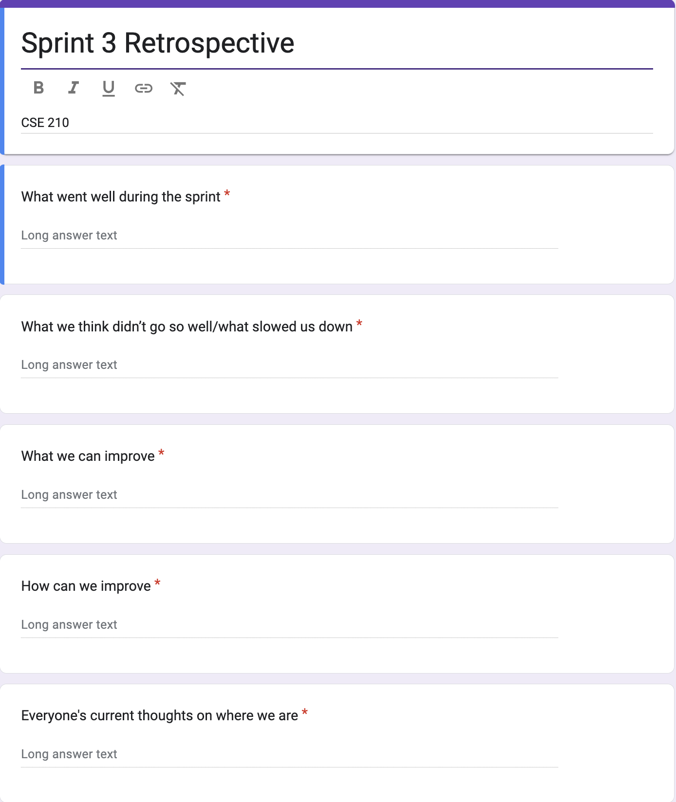
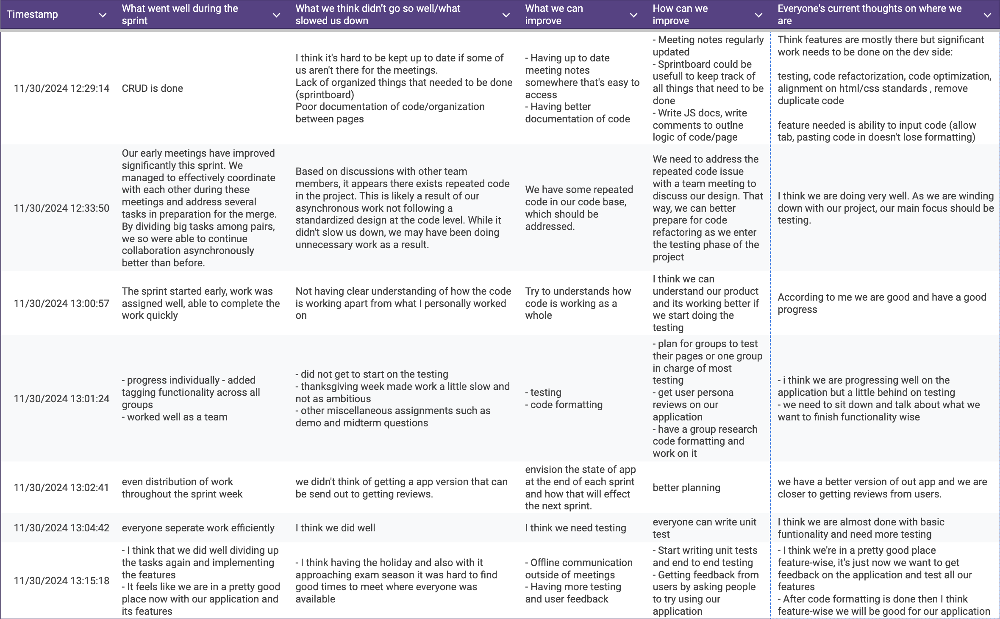

# Team Meeting Notes - Retrospective 3 Review Meeting

**Date: Saturday 11.30.2024**\
**Time: 1:00 pm - 1:30 pm**\
**Meeting Format: Hybrid (Zoom and CSE Basement)**

## Attendance

- [x] Niyas Attasseri (NA)
- [x] Anna Niu (AN)
- [x] Krishna Ponnaganti (KP)
- [x] Juhak Lee (JL)
- [x] Brandon Olmos (BO)
- [x] Jayanth Gorantla (JG)
- [x] Lucas Lee (LL)

## Retrospective

The goal of this meeting is to reflect on how Sprint #3 went. We discussed our thoughts on what went well during the sprint, what didn't go well, what/how we can improve, and what everyone's thoughts are on where we currently are with the project. We collected everyone's thoughts using an anonymous Google Form. The questions in the form can be seen here: 

The individual responses collected can also be seen below: 

After collecting and reviewing these Google Form responses, we then had an open discussion regarding our thoughts on how the sprint went and what we hope to improve/change for the next sprint.

## What went well during the sprint

In this question, we discussed our thoughts on what went well overall during the sprint. Overall, we thought that the work for this sprint was divided effectively as we continued to work in pairs, our meetings were much more efficient, and work was started and completed early this sprint.

### Individual Responses:

1. CRUD is done
2. Our early meetings have improved significantly this sprint. We managed to effectively coordinate with each other during these meetings and address several tasks in preparation for the merge. By dividing big tasks among pairs, we so were able to continue collaboration asynchronously better than before.
3. The sprint started early, work was assigned well, able to complete the work quickly
4. - progress individually 
   - added tagging functionality across all groups
   - worked well as a team
5. even distribution of work throughout the sprint week
6. everyone seperate work efficiently 
7. - I think that we did well dividing up the tasks again and implementing the features
   - It feels like we are in a pretty good place now with our application and its features

## What we think didn’t go so well/what slowed us down

In this question, we discussed our thoughts on what didn't go well during the sprint, and what slowed down our progress. Overall, there were some communication issues when not everyone could attend the meetings, there is also some code duplication within the repo due to pairs working on features separately, and our work was also slowed down due to the holiday and so we were unable to start on testing this sprint.

### Individual Responses:

1. I think it's hard to be kept up to date if some of us aren't there for the meetings. 
   Lack of organized things that needed to be done (sprintboard)
   Poor documentation of code/organization between pages
2. Based on discussions with other team members, it appears there exists repeated code in the project. This is likely a result of our asynchronous work not following a standardized design at the code level. While it didn't slow us down, we may have been doing unnecessary work as a result.
3. Not having clear understanding of how the code is working apart from what I personally worked on
4. - did not get to start on the testing 
   - thanksgiving week made work a little slow and not as ambitious
   - other miscellaneous assignments such as demo and midterm questions"
5. we didn't think of getting a app version that can be send out to getting reviews.
6. I think we did well
7. - I think having the holiday and also with it approaching exam season it was hard to find good times to meet where everyone was available

## What we can improve

We asked everyone their thoughts on what can be improved for future sprints. People thought that we can improve by having more code documentation, having everyone understand the code thoroughly, starting testing, and ironing out the final features we want to include for the application as the quarter winds down.

### Individual Responses:

1. - Having up to date meeting notes somewhere that's easy to access
   - Having better documentation of code
2. We have some repeated code in our code base, which should be addressed.
3. Try to understands how code is working as a whole
4. - testing 
   - code formatting
5. envision the state of app at the end of each sprint and how that will effect the next sprint.
6. I think we need testing
7. - Offline communication outside of meetings
   - Having more testing and user feedback

## How can we improve

Based on their concerns discussed above, people also shared their thoughts on how we can improve for future sprints. The main points brought up were to have better offline communication to keep everyone up-to-date, refactor the code to remove any redundancies/code duplication, and start testing and getting feedback on our application.

### Individual Responses:

1. - Meeting notes regularly updated
   - Sprintboard could be usefull to keep track of all things that need to be done
   - Write JS docs, write comments to outlne logic of code/page
2. We need to address the repeated code issue with a team meeting to discuss our design. That way, we can better prepare for code refactoring as we enter the testing phase of the project
3. I think we can understand our product and its working better if we start doing the testing
4. - plan for groups to test their pages or one group in charge of most testing
   - get user persona reviews on our application
   - have a group research code formatting and work on it
5. better planning
6. everyone can write unit test
7. - Start writing unit tests and end to end testing
   - Getting feedback from users by asking people to try using our application

## Everyone's current thoughts on where we are

Finally, everyone shared their thoughts on where we currently are in the process. Overall, people thought that functionality-wise our application is in a good place, and that our focus for this upcoming sprint should be on testing the application and getting feedback from users.

### Individual Responses:

1. Think features are mostly there but significant work needs to be done on the dev side:
   - testing, code refactorization, code optimization, alignment on html/css standards , remove duplicate code
   - feature needed is ability to input code (allow tab, pasting code in doesn't lose formatting)
2. I think we are doing very well. As we are winding down with our project, our main focus should be testing.
3. According to me we are good and have a good progress
4. - i think we are progressing well on the application but a little behind on testing
   - we need to sit down and talk about what we want to finish functionality wise
5. we have a better version of out app and we are closer to getting reviews from users.
6. I think we are almost done with basic funtionality and need more testing
7. - I think we're in a pretty good place feature-wise, it's just now we want to get feedback on the application and test all our features
   - After code formatting is done then I think feature-wise we will be good for our application"
