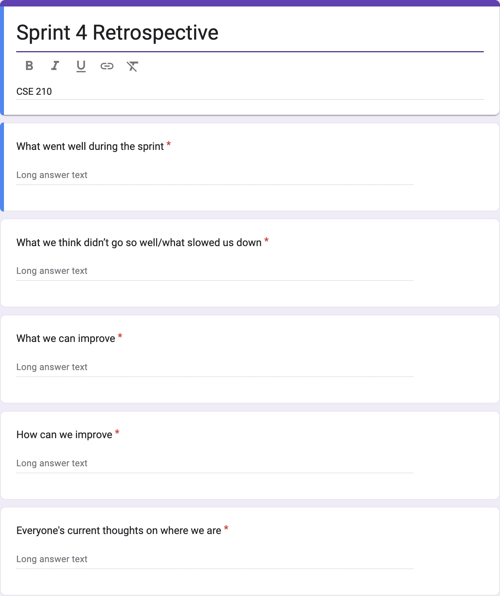
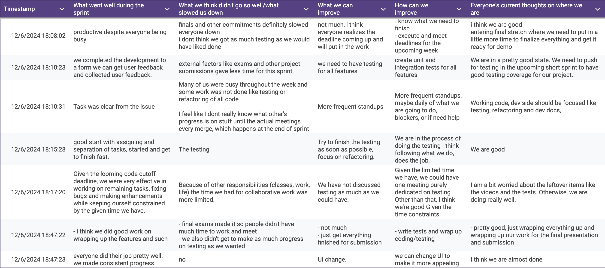

# Team Meeting Notes - Retrospective 4 Review Meeting

**Date: Friday 12.6.2024**\
**Time: 7:00 pm - 7:30 pm**\
**Meeting Format: In-Person (CSE Basement)**

## Attendance

- [x] Niyas Attasseri (NA)
- [x] Anna Niu (AN)
- [x] Krishna Ponnaganti (KP)
- [x] Juhak Lee (JL)
- [x] Brandon Olmos (BO)
- [x] Jayanth Gorantla (JG)
- [x] Lucas Lee (LL)

## Retrospective

The goal of this meeting is to reflect on how Sprint #4 went. We discussed our thoughts on what went well during the sprint, what didn't go well, what/how we can improve, and what everyone's thoughts are on where we currently are with the project. We collected everyone's thoughts using an anonymous Google Form. The questions in the form can be seen here: 

The individual responses collected can also be seen below: 

After collecting and reviewing these Google Form responses, we then had an open discussion regarding our thoughts on how the sprint went and what we hope to improve/change for the next sprint.

## What went well during the sprint

In this question, we discussed our thoughts on what went well overall during the sprint. Overall, most people thought that we were able to make good progress in this final stretch despite everyone being busy due to finals.

### Individual Responses:

1. productive despite everyone being busy
2. we completed the development to a form we can get user feedback and collected user feedback.
3. Task was clear from the issue 
4. good start with assigning and separation of tasks, started and get to finish fast.
5. Given the looming code cutoff deadline, we were very effective in working on remaining tasks, fixing bugs and making enhancements while keeping ourself constrained by the given time we have.
6. - i think we did good work on wrapping up the features and such
7. everyone did their job pretty well. we made consistent progress

## What we think didn’t go so well/what slowed us down

In this question, we discussed our thoughts on what didn't go well during the sprint, and what slowed down our progress. Overall, people thought that what slowed us down the most were finals coming up, and so we didn't make as much progress on testing and refactoring as we wanted to.

### Individual Responses:

1. finals and other commitments definitely slowed everyone down
   i dont think we got as much testing as we would have liked done
2. external factors like exams and other project submissions gave less time for this sprint.
3. Many of us were busy throughout the week and some work was not done like testing or refactoring of all code
   I feel like I dont really know what other's progress is on stuff until the actual meetings every merge, which happens at the end of sprint"
4. The testing
5. Because of other responsibilities (classes, work, life) the time we had for collaborative work was more limited.
6. - final exams made it so people didn't have much time to work and meet
- we also didn't get to make as much progress on testing as we wanted
7. no

## What we can improve

We asked everyone their thoughts on what can be improved for the final sprint. People thought that we mainly needed to focus on testing and refactoring, while finishing the other documents needed for the final submission.

### Individual Responses:

1. not much, i think everyone realizes the deadline coming up and will put in the work
2. we need to have testing for all features
3. More frequent standups
4. Try to finish the testing as soon as possible, focus on refactoring. 
5. We have not discussed testing as much as we could have.
6. - not much
   - just get everything finished for submission
7. UI change. 

## How can we improve

Based on their concerns discussed above, people also shared their thoughts on how we can improve for this final sprint. Overall, the main consensus was that we needed to wrap up testing and refactoring, and have things ready for the final submission and presentation.

### Individual Responses:

1. - know what we need to finish
   - execute and meet deadlines for the upcoming week
2. create unit and integration tests for all features
3. More frequent standups, maybe daily of what we are going to do, blockers, or if need help
4. We are in the process of doing the testing I think following what we do, does the job,
5. Given the limited time we have, we could have one meeting purely dedicated on testing. Other than that, I think we're good Given the time constraints.
6. - write tests and wrap up coding/testing
7. we can change UI to make it more appealing 

## Everyone's current thoughts on where we are

Finally, everyone shared their thoughts on where we currently are in the process. Overall, everyone thought that we are in a good place, and just need to focus on the final submission and presentation.

### Individual Responses:

1. i think we are good
   entering final stretch where we need to put in a little more time to finalize everything and get it ready for demo"
2. We are in a pretty good state. We need to push for testing in the upcoming short sprint to have good testing coverage for our project.
3. Working code, dev side should be focused like testing, refactoring and dev docs, 
4. We are good
5. I am a bit worried about the leftover items like the videos and the tests. Otherwise, we are doing really well.
6. - pretty good, just wrapping everything up and wrapping up our work for the final presentation and submission
7. I think we are almost done 