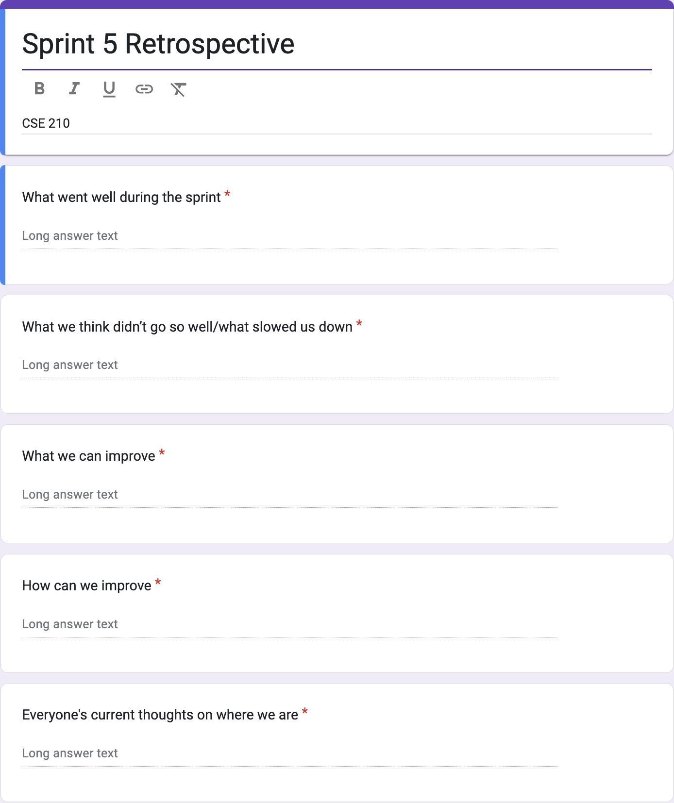
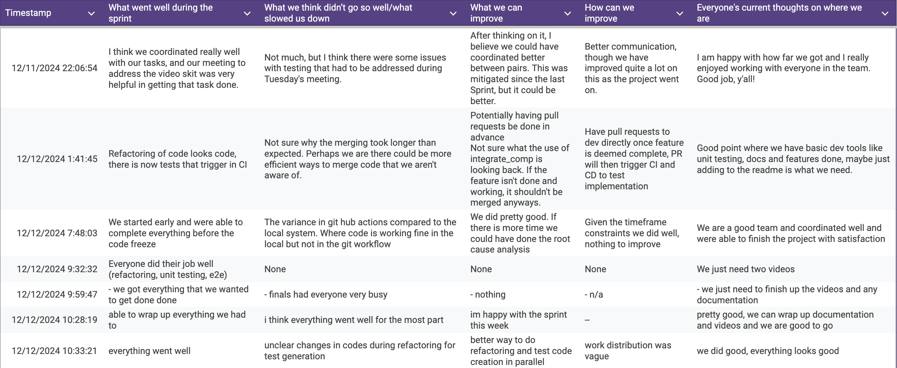

# Team Meeting Notes - Retrospective 5 Review Meeting

**Date: Thursday 12.12.2024**\
**Time: 10:45 am - 11:00 am**\
**Meeting Format: Online (Zoom)**
## Attendance

- [x] Niyas Attasseri (NA)
- [x] Anna Niu (AN)
- [x] Krishna Ponnaganti (KP)
- [x] Juhak Lee (JL)
- [ ] Brandon Olmos (BO)
- [x] Jayanth Gorantla (JG)
- [x] Lucas Lee (LL)

## Retrospective

The goal of this meeting is to reflect on how Sprint #5 went. We discussed our thoughts on what went well during the sprint, what didn't go well, what/how we can improve, and what everyone's thoughts are on where we currently are with the project. We collected everyone's thoughts using an anonymous Google Form. The questions in the form can be seen here: 

The individual responses collected can also be seen below: 

After collecting and reviewing these Google Form responses, we then had an open discussion regarding our thoughts on how the sprint went and what we could have improved/changed.

## What went well during the sprint

In this question, we discussed our thoughts on what went well overall during the sprint. Overall, everyone thought that this final sprint went well and we completed the tasks we set out for ourselves.

### Individual Responses:

1. I think we coordinated really well with our tasks, and our meeting to address the video skit was very helpful in getting that task done.
2. Refactoring of code looks code, there is now tests that trigger in CI
3. We started early and were able to complete everything before the code freeze
4. Everyone did their job well (refactoring, unit testing, e2e)
5. - we got everything that we wanted to get done done
6. able to wrap up everything we had to
7. everything went well

## What we think didn’t go so well/what slowed us down

In this question, we discussed our thoughts on what didn't go well during the sprint, and what slowed down our progress. Overall, most people agreed that there were some issues with tests and Github actions that needed to be resolved, which made merging take longer than expected.

### Individual Responses:

1. Not much, but I think there were some issues with testing that had to be addressed during Tuesday's meeting.
2. Not sure why the merging took longer than expected. Perhaps we are there could be more efficient ways to merge code that we aren't aware of. 
3. The variance in git hub actions compared to the local system. Where code is working fine in the local but not in the git workflow
4. None
5. - finals had everyone very busy
6. i think everything went well for the most part
7. unclear changes in codes during refactoring for test generation

## What we can improve

We asked everyone their thoughts on what could have been improved for this final sprint. People mentioned having better coordination between pairs, working more in parallel, and having merges done more in advance.

### Individual Responses:

1. After thinking on it, I believe we could have coordinated better between pairs. This was mitigated since the last Sprint, but it could be better.
2. Potentially having pull requests be done in advance
   Not sure what the use of integrate_comp is looking back. If the feature isn't done and working, it shouldn't be merged anyways.
3. We did pretty good. If there is more time we could have done the root cause analysis
4. None
5. - nothing
6. im happy with the sprint this week
7. better way to do refactoring and test code creation in parallel

## How can we improve

Based on their concerns discussed above, people also shared their thoughts on how we could have improved. Some people mentioned having better communication and a specific pipeline for pull requests, but overall most people agreed that we did well for this final sprint.

### Individual Responses:

1. Better communication, though we have improved quite a lot on this as the project went on.
2. Have pull requests to dev directly once feature is deemed complete, PR will then trigger CI and CD to test implementation
3. Given the timeframe constraints we did well, nothing to improve
4. None
5. - n/a
6. --
7. work distribution was vague

## Everyone's current thoughts on where we are

Finally, everyone shared their thoughts on where we currently are in the process. Overall, we need to submit the final videos and finish some documentation, but otherwise we have completed the project well and everything looks good.

### Individual Responses:

1. I am happy with how far we got and I really enjoyed working with everyone in the team. Good job, y'all!
2. Good point where we have basic dev tools like unit testing, docs and features done, maybe just adding to the readme is what we need.
3. We are a good team and coordinated well and were able to finish the project with satisfaction
4. We just need two videos
5. - we just need to finish up the videos and any documentation
6. pretty good, we can wrap up documentation and videos and we are good to go
7. we did good, everything looks good 