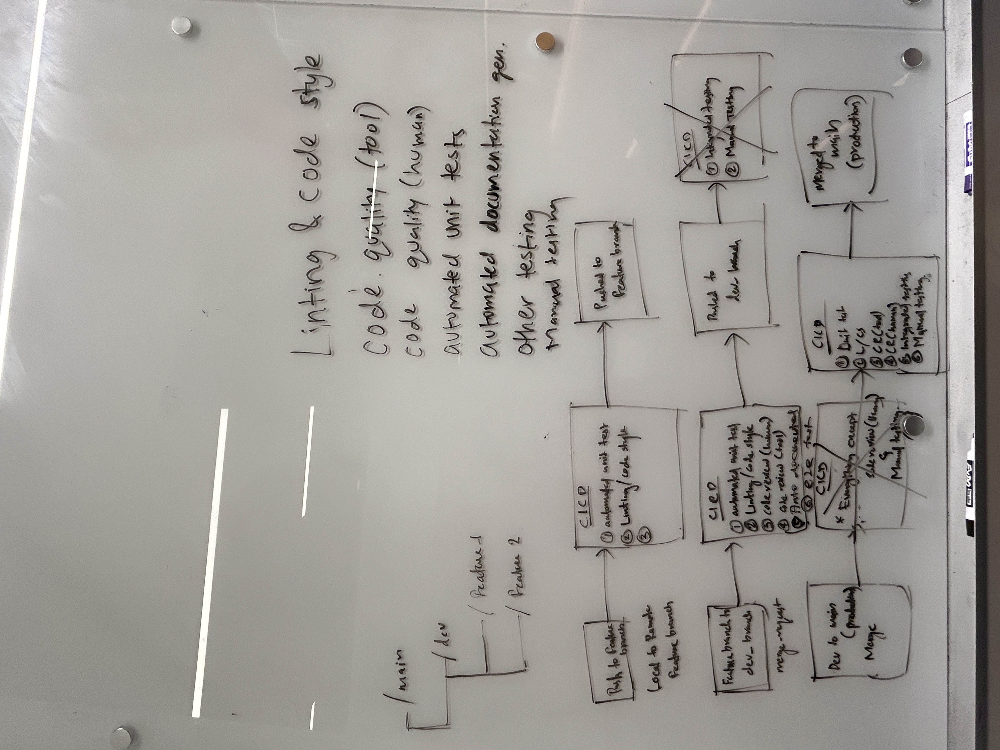

# Team Meeting Notes - CICD Pipeline Team Meeting

**Date: Wednesday 11.13.2024**\
**Time: 6:30 pm - 8:10 pm**\
**Meeting Format: In-Person (CSE Basement)**

## Attendance

- [x] Niyas Attasseri (NA)
- [x] Anna Niu (AN)
- [x] Krishna Ponnaganti (KP)
- [x] Juhak Lee (JL)
- [x] Brandon Olmos (BO)
- [x] Jayanth Gorantla (JG)
- [x] Lucas Lee (LL)

## Agenda

- Discuss and begin working on CI/CD Pipeline

## Completed Tasks

- Discussed how we wanted to set up CICD pipeline
- Drew a draft of the basic pipeline: 

## Tasks to be completed

- Research into tools for linting/code quality/unit test/documentation/e2e testing/etc.
    - Linting and code style (Lucas)
    - Github pages for development (Juhak)
    - Code quality via tool/human (Jay and Anna)
    - Documentation generation (Niyas)
    - Unit Testing (Brandon)
        - Look into Jest
    - E2E Testing (Krishna)
        - Look into Puppeteer

## Planned meetings

- Friday 15th Nov 10:00AM CSE Basement