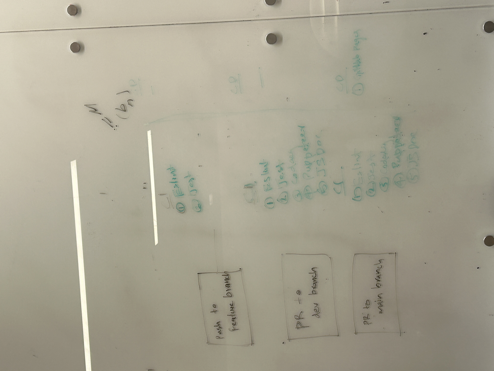
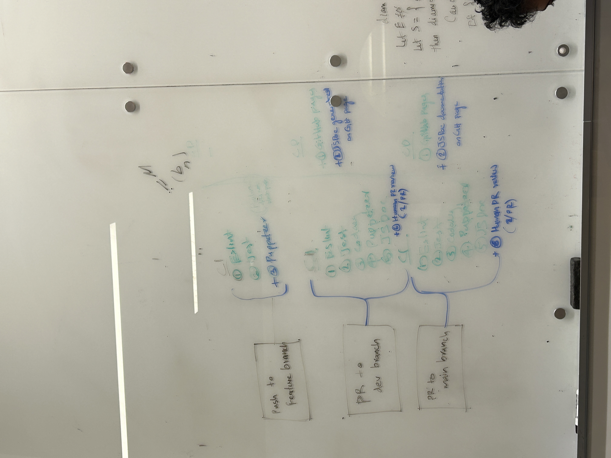

# Team Meeting Notes - CICD Pipeline Team Meeting

**Date: Sunday 11.17.2024**\
**Time: 12:00 pm - 2:00 pm**\
**Meeting Format: In-Person (CSE Basement)**

## Attendance

- [x] Niyas Attasseri (NA)
- [x] Anna Niu (AN)
- [x] Krishna Ponnaganti (KP)
- [x] Juhak Lee (JL)
- [x] Brandon Olmos (BO)
- [x] Jayanth Gorantla (JG)
- [x] Lucas Lee (LL)

## Agenda

- Merge E2E testing branch into dev
- Transfer ADRs from google drive to MD files
- Finish Pipeline writeup and transfer to MD file
- Update workflows 
- Update CICD diagram and add to repo
- Do sprint meeting and take notes
- Add sprint meeting notes to repo
- Merge document branch to dev
- Delete branches already merged in
- Assign issues to merges and close issues

## Completed Tasks

- Merge E2E testing branch into dev
- Update workflows 
- Assign issues to merges and close issues
- Delete branches already merged in
- Transfer ADRs from google drive to MD files
- Update CICD diagram and add to repo
    - Whiteboard picture of current pipeline (as of end of sprint): 
    - Whiteboard picture of what we want pipeline to be for next sprint: 
- Do sprint meeting and take notes
- Add sprint meeting notes to repo
- Finish Pipeline writeup and transfer to MD file
- Merge document branch to dev

## Tasks to be completed

- Retrospective Meeting

## Planned meetings

- Monday 18th Nov 6:30PM Zoom
    - Before meeting: read chapter from textbook