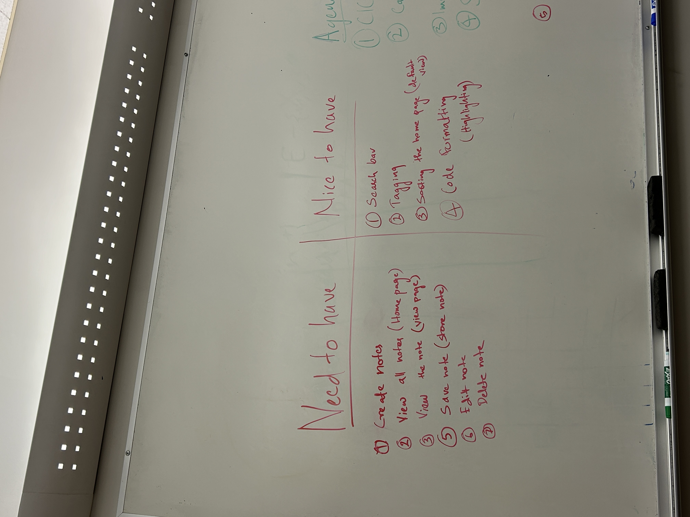

# Team Meeting Notes - Sprint 2 Team Meeting

**Date: Wednesday 11.20.2024**\
**Time: 6:30 pm - 8:15 pm**\
**Meeting Format: In-Person (CSE Basement)**

## Attendance

- [x] Niyas Attasseri (NA)
- [x] Anna Niu (AN)
- [x] Krishna Ponnaganti (KP)
- [x] Juhak Lee (JL)
- [x] Brandon Olmos (BO)
- [x] Jayanth Gorantla (JG)
- [x] Lucas Lee (LL)

## Agenda

1. CICD improvement/review
2. Categorize
    a. Need to have
    b. Nice to have
3. Implementing our wire frame
4. Storage
    a. Browser local storage
    b. File system
    c. Index
    d. Database
5. Data layout

## Completed Tasks

- Discuss CICD improvement needed to be done by next meeting
    - Brandon: add Jest dependency
    - Krishna: add Puppetteer dependency
    - Jay: fix Codacy config file
- We should make an ADR about deciding type of storage
    - Browser local storage
        - Right now have decided to go with local storage. But we will write modular code so if needed can switch out backend and use file system or something
    - File system
    - Index
    - Database
- Need to Have vs. Nice to Have
    - Need to have
        - Create new note
        - View all notes (home page)
        - Save note (store note)
        - Edit note
        - Delete note
    - Nice to Have
        - Search function
        - Tagging
        - Sorting home page (default view)
        - Code formatting / syntax highlighting
- Sorted Priority List
    1. Having a home page
    2. View list of all notes on home (for now dummy notes)
    3. View individual notes
    4. Create note
    - Get above four done for sprint 1
    5. Save note
    6. Edit note
    7. Delete note

- Data Layout
    - File type
        - Dict 
    - Fields
        - Input - ‘string’
        - Output - ‘string’

- Java Script object to represent JSON format:
-   data: {id: int, 
    title: “string”, 
    code: “string”
    comments: “string”
    creation_timestamp: “posix”
    }
- all_notes = stringify([id’s])
- Next iteration: multiple code and comment blocks in a note
    {id: int, 
    title: “string”, 
    code: {
	    codeblock_1: “string”
	    …
	    }
    comments: {
	    comment_1: “string”,
	    …
	    }
    creation_timestamp: “posix”
    last_edited_timestamp: “posix”
    }
- How ID’s generated
    - Local variable: last_id
    - Increment this
- Splitting work for next meeting:
    - Data: lucas
    - Home page + view list of notes: anna + juhak
    - View individual notes: niyas + krishna
    - Create notes: jay + brandon
    - View and create teams have to talk to each other
    - Test code as you go
- Repo structure:
    - source
        - JS
            - home.js
        - HTML
        - CSS
- Meeting images: 
     
     
    
    

## Tasks to be completed

- Final fixes for CICD pipeline
- Make storage ADR
- Home page, View page, Create page, data functionality

## Planned meetings

- Friday 22nd Nov 1:30PM CSE Basement