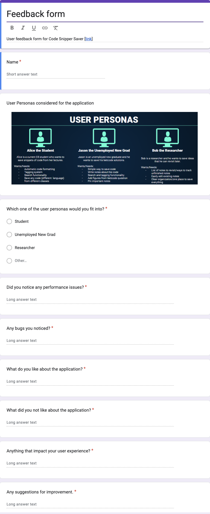

# Team Meeting Notes - Sprint 4 Team Meeting

**Date: Wednesday 12.4.2024**\
**Time: 6:30 pm - 8:30 pm**\
**Meeting Format: In-Person (CSE Basement)**

## Attendance

- [x] Niyas Attasseri (NA)
- [x] Anna Niu (AN)
- [x] Krishna Ponnaganti (KP)
- [x] Juhak Lee (JL)
- [x] Brandon Olmos (BO)
- [x] Jayanth Gorantla (JG)
- [x] Lucas Lee (LL)

## Agenda

1. Discuss changes we made so far for sprint 4
2. Merge sprint 4 changes into integrate_comp
3. Merge integrate_comp into dev
4. Create feedback form to get user reviews
5. Discuss testing

## Completed Tasks

- Changes made so far
    - Input validation for create and edit pages for note title and tag
    - Search by title only
    - Fixed view bug that rendered code
        - Change inner_html to textArea
    - Filter via tag
    - Code formatting / indentation preserved
    - Refactoring -> so far have util.js that has common functions
    - Edit page can edit tags
- Merged sprint 4 changes into integrate_comp
- Merged integrate_comp into dev
- Created feedback form to send out to people to review by friday. See form here: 
- Discussion of testing to do by friday

## Tasks to be completed

- Testing
- Send out feedback form to get user reviews/feedback
- Continue refactoring

## Planned meetings

- Friday 6th Dec 5:00PM CSE Basement