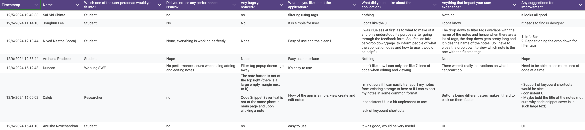

# Team Meeting Notes - Sprint 4 Team Meeting

**Date: Friday 12.6.2024**\
**Time: 5:00 pm - 7:30 pm**\
**Meeting Format: In-Person (CSE Basement)**

## Attendance

- [x] Niyas Attasseri (NA)
- [x] Anna Niu (AN)
- [x] Krishna Ponnaganti (KP)
- [x] Juhak Lee (JL)
- [x] Brandon Olmos (BO)
- [x] Jayanth Gorantla (JG)
- [x] Lucas Lee (LL)

## Agenda

1. Discuss what we completed this sprint
2. Merge refactoring of edit and create to dev
3. Discuss tests written so far
    - Make ADR for using JSDom to use Jest for browser UI testing (ADR 11)
    - Make ADR for refactoring (ADR 10)
4. Go over user reviews collected so far
5. Set deadlines for our team
6. Discuss what we want to finish code-wise before Monday
7. Sprint Review
8. Sprint Retrospective

## Completed Tasks

- Completed this sprint
    - Input validation for create and edit pages for note title and tag
    - Search by title only
    - Fixed view bug that rendered code
        - Change inner_html to textArea
    - Filter via tag
    - Code formatting / indentation preserved
    - Refactoring → so far have util.js that has common functions
    - Create and edit page refactored fully
    - Edit page can edit tags
    - Begun writing tests
- Merged refactoring of edit and creat to dev
- Go over user reviews collected. See responses here: 
    - UI fix → make consistent across all pages → finished
    - Add to README to describe what application does
    - Make code box bigger in view / edit / create → need to do
    - Make note titles bigger → did on sprint5_view_uifix
    - Move tags filter so doesn’t go over notes → did on sprint5_home_uifix2
    - Make tags dropdown disappear if you click anywhere on the screen → did on sprint5_home_uifix2
- Set deadlines for our team
    - When stop coding (code freeze 11th): monday 12/9
    - When finish testing: tuesday 12/10
    - Record videos (due thursday night): do wednesday 12/11 and thursday 12/12
    - Documentation (due friday noon): tuesday / wednesday before video
- What we want to finish code-wise before monday
    Front facing readme for “customer”
    Another readme for someone who wants to pick up where we left off
- Sprint Review
- Sprint Retrospective

## Tasks to be completed

- Finish testing
- Make ADR for using JSDom to use Jest for browser UI testing (ADR 11)
- Add to README to describe what application does
- Make code box bigger in view / edit / create → need to do
- Finish refactoring view page and home page

## Planned meetings

- Tuesday 10th Dec 5:00PM CSE Basement
    - Show-off Video (Total duration: 3 minutes): (1 hour)
        - Need to have a skit 
    - Lessons video (Duration: 4-5 minutes): 
        - Need content made even before: Project lessons and key takeaways
    - Technical video  (Duration: 10-15 minutes): 
